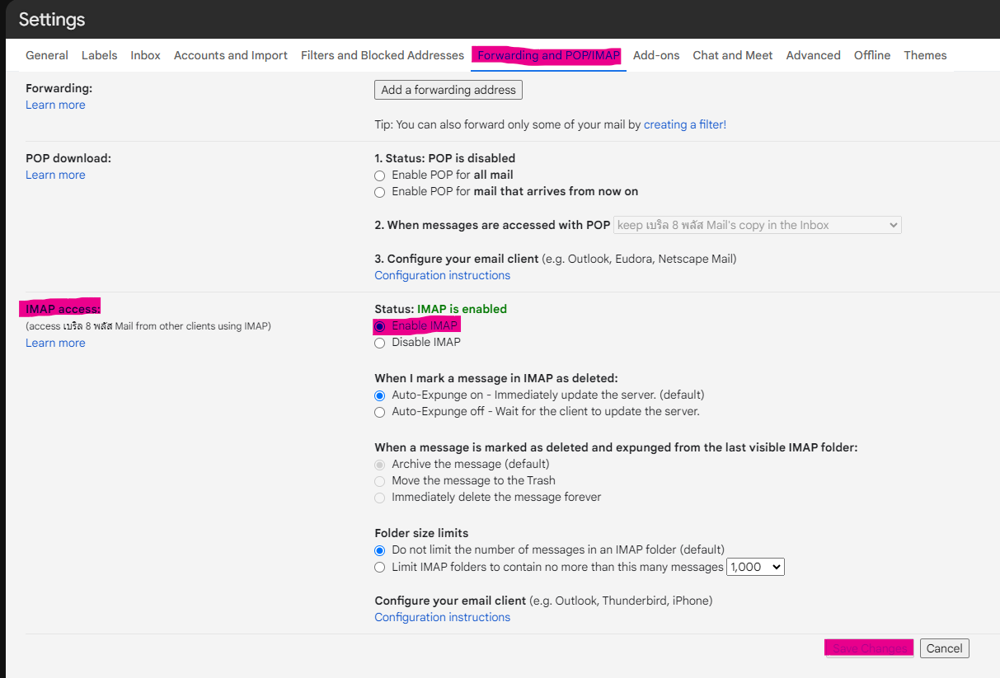
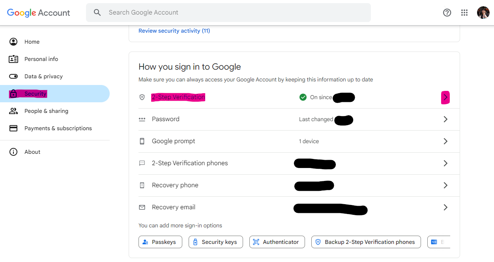
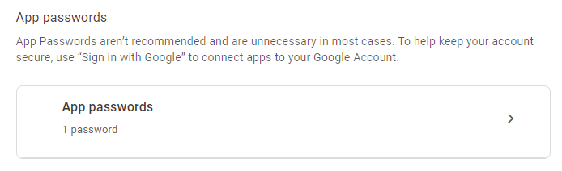
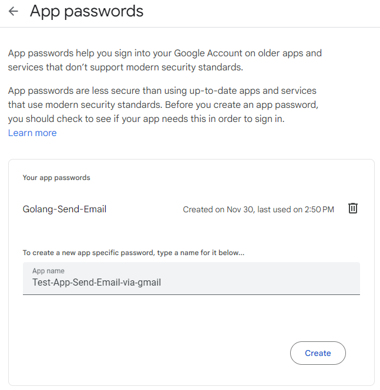
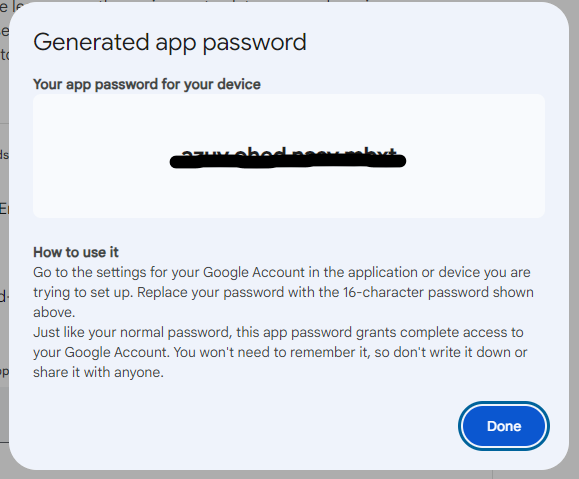

# send-email-vid-gmail
Sending Email And Attachment With GO (Golang) Using SMTP, Gmail

## Setting Gmail and Account
First setup your gmail account like this. You can access here from settings/all settings,
Open Forwarding and POP/IMAP. Enable IMAP and save changes.



Then open Google Account/Security. Open Application Passwords. (You need 2-Step Verification)



Open App passwords



Create a new app specifice password, type a name for it below.



Save passwords for apps.

> [!NOTE]\
> Unable to copy text



## Configuration Env File

Create `configuration.yaml`

> [!NOTE]\
> From, password, to and cc Encode to base64

```yaml
email:
  from: "cGhhbnVwaG9uZy5wQGJlcnlsOC5jb20="
  password: "c2VzZ2lxeHpyb2t0cmZsaA=="
  smtphost: "smtp.gmail.com"
  smtpport: "587"
  to: 
   - "cGhhbnVwaG9uZy5wQGJlcnlsOC5jb20="
  #  - "dGhlamFtZXphczEyQGdtYWlsLmNvbQ=="
  cc:
   - "dGhlamFtZXphczEyQGdtYWlsLmNvbQ=="
   - "dGhlamFtZXphc0Bob3RtYWlsLmNvbQ=="
   - "ZHVhbmdydXRoYWkwNEBnbWFpbC5jb20="
  subject: "Test Send Email via Gmail {DD-MM-YYYY}"
```

## Code Review

> [!NOTE]\
> Attach path can be specified in string format.

```go
email.NewSendEmail(Config, "./export/test-file.txt")
```

### Function SendEmail

```go
func NewSendEmail(Config models.Config, Pathfile string) {
	logger := util.NewCustomLogger("controller 🚀 | NewSendEmail")

	body := "This is Test Send Email via Gmail SMTP"

	m := gomail.NewMessage()
	m.SetHeader("From", Config.Email.From)
	m.SetHeader("To", Config.Email.To...)
	m.SetHeader("Cc", Config.Email.Cc...)
	m.SetHeader("Subject", Config.Email.Subject)
	m.SetBody("text/html", body)
	m.Attach(Pathfile)

	SMTPPort, err := strconv.Atoi(Config.Email.SMTPPort)
	if err != nil {
		logger.Error("Error conv Str to int", "err", err)
	}

	d := gomail.NewDialer(Config.Email.SMTPHost, SMTPPort, Config.Email.From, Config.Email.Password)

	// Send the email
	if err := d.DialAndSend(m); err != nil {
		logger.Error("Error Dial And Send Email", "err", err)
		panic(err)
	} else {
		logger.Info("📨 Email sent successfully.")
	}

}
```

